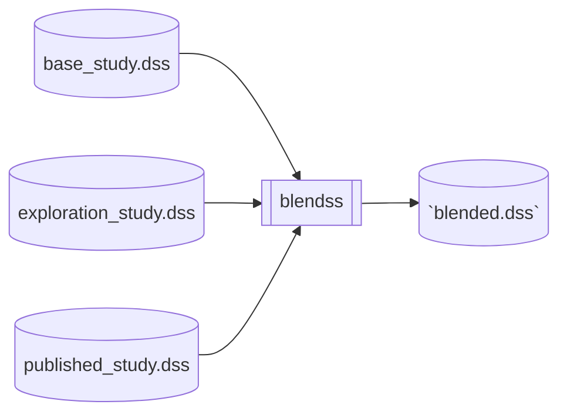

# blendss 🍹

Combine multiple DSS files into one for post-processing, and model comparison.



## Example

I have two DSS files, as described below:

- DSS #1, This is a DSS file that contains model outputs from a published study. One of the outputs is `/MODEL/RESULT/FLOW///L2020A/`.
- DSS #2, This is a DSS file that I made, which contins model outputs from my own study. The `/MODEL/RESULT/FLOW///L2020A/` is also in my dataset.

I want to compare the results of these models by looking at `/MODEL/RESULT/FLOW///L2020A/`. The problem is, I need to carry around both of these DSS files if I want to do that. 

__I need to blend these DSS files together!__

If I use `blendss`, I can combine the two DSS files like this:

- From DSS #1, we copy `/MODEL/RESULT/FLOW///L2020A/` to the new DSS file, renaming it to `/PUBLISED/RESULT/FLOW///L2020A/`.
- From DSS #2, we copy `/MODEL/RESULT/FLOW///L2020A/` to the new DSS file, renaming it to `/MINE/RESULT/FLOW///L2020A/`.

Since we a are changing the `A-part` of the DSS path, these two datasets don't collide. We can choose the new `A-part` to be descriptive, so the content semi-self-docuemnts.

__How do I do this with `blendss`?__

1. Create a `toml` configuration file that looks like this:

```toml
[[study]]
a="PUBLISHED"
dss="/path/to/DSS#1.dss"

[[study]]
a="MINE"
dss="/path/to/DSS#2.dss"
```

2. Create a `fv` file that looks like this:

|B     |C   |
|-     |   -|
|RESULT|FLOW|

3. Run blendss:

```powershell
ptyhon -m blendss "path/to/your/config.toml" --fv "/path/to/your/config.fv"
```

You can even use one of our built-in fv files like this:

```powershell
ptyhon -m blendss "path/to/your/config.toml" --fv "calsim3"
```

## Included FV files

- `calsim3.fv`: Standard paths read from the CalSim3 DV file.
